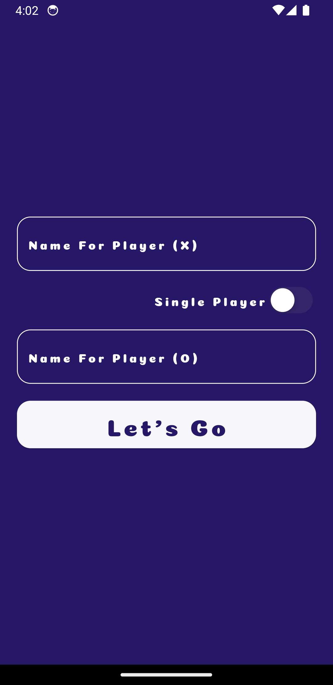
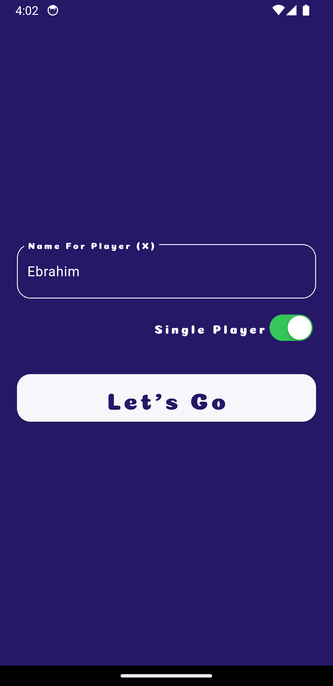
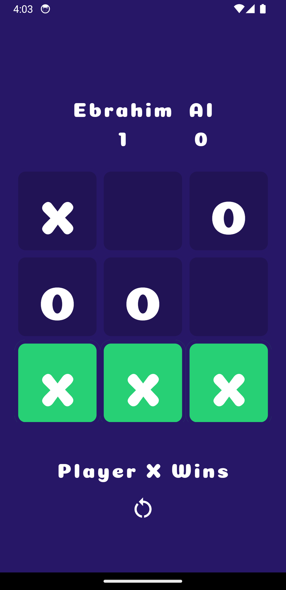
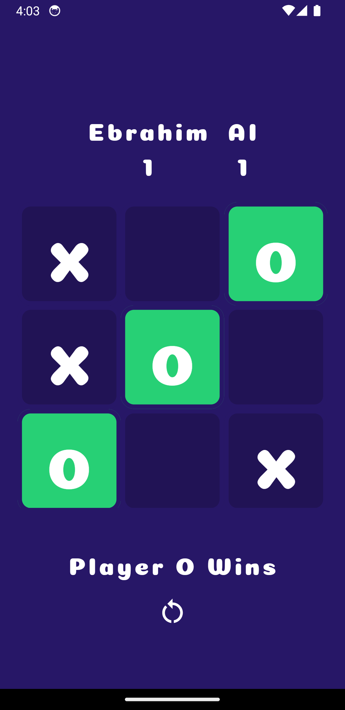

# X O Flutter App

A simple X O game built with Flutter.

## Introduction

A simple Flutter application for playing X O. The app allows users to play against each other or Single-player mode.

## Features

- Two-player mode (Player X vs. Player O)
- Single-player mode
- Score tracking
- Clean and responsive UI

## Screenshots







## Project Structure

The project follows a modular structure for better organization and maintainability. Here is an overview of the project structure:

```plaintext
lib/
|-- models/
|   |-- player_model.dart
|-- utils/
|   |-- constants.dart
|-- viewmodels/
|   |-- game_viewmodel.dart
|   |-- login_viewmodel.dart
|-- views/
|   |-- game_screen.dart
|   |-- login_screen.dart
|   |-- splash_screen.dart
|-- main.dart
